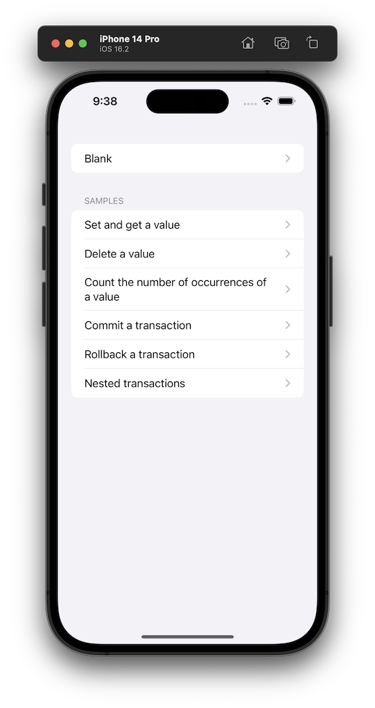
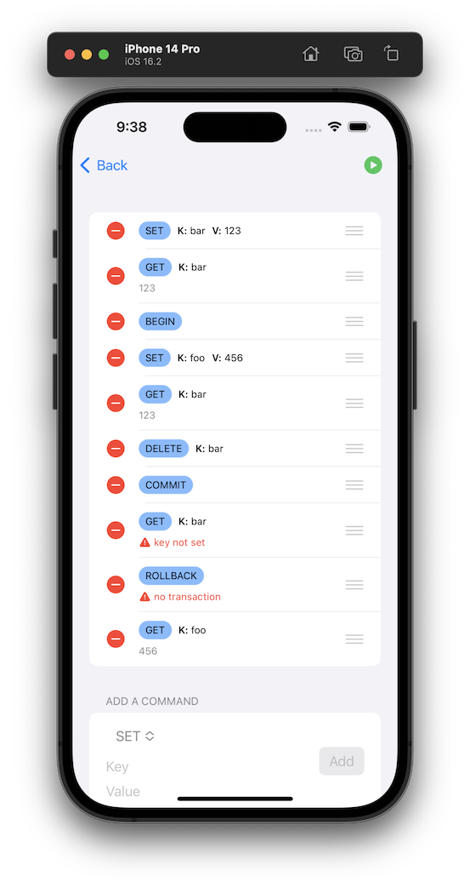

# Transactional Key-Value Store

<table>
<tr>
<td></td>
<td></td>
</tr>
</table>

## Simplifications

### Transactions
There are various approaches to implementing transactional stores, such as event sourcing or
mutiversion concurrency control. In this example, I implemented a stack of state overrides for simplicity.

The implementation can be replaced or optimised depending on specific use cases.

### User interface
Initially, I thought of implementing a UI similar to the Sketch programming language, which prevents entering
a sequence of commands with unbalanced `BEGIN`s and `COMMIT`/`ROLLBACK`s. However, then I thought it would
not allow demonstrating some of the sample sequences. The current UI implementation uses the standard SwiftUI views
as much as possible without much customisation.

The focus of this project was to have a clean separation of concerns and follow SOLID principles to achieve good
testability and maintainability of the project.

For simplicity, the UI doesn't have editing of the commands. If required, it can be achieved by deleting, appending a 
new one and then reordering the commands. Technically it is not difficult to implement, but I thought it would
be better to focus on the core use cases to demonstrate the app's architecture.

## Testing
### Snapshot testing
The visual representation of views is tested using [SnapshotTesting](https://github.com/pointfreeco/swift-snapshot-testing#installation)
framework. The main purpose is to detect when a view changes and then let the developer decide whether the change
was intentional or not. If it is intentional, then you can delete the failed snapshot from [__Snapshots__](TKVStoreSnapshotTests/__Snapshots__) directory
and re-run the tests to generate the updated snapshot.
